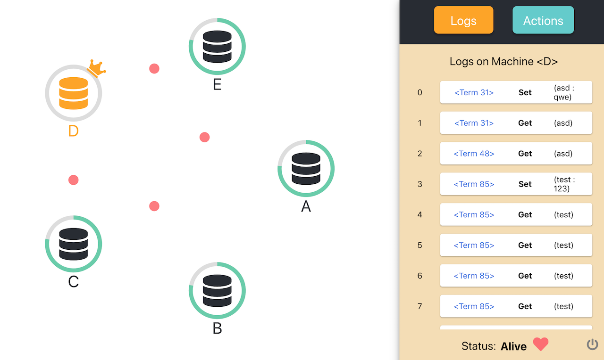
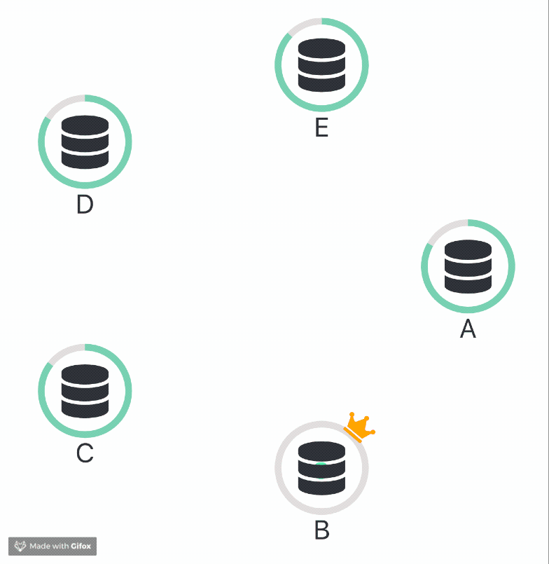
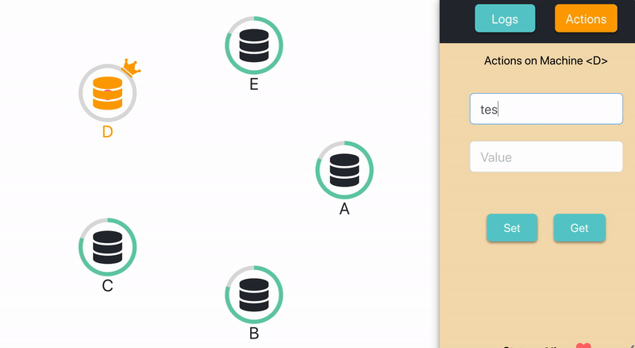

# COEN317-Raft-KVService

A distributed Key/value storage service based on *[Raft](https://raft.github.io/raft.pdf)* paper and its visualization.

<p align="center">

</p>

---

## Quick Start

- Fetch and update submodules

```bash
git submodule update --init --recursive
```

- Start the server

```bash
cd server
docker-compose build && docker-compose up
```

- Start the client
```bash
cd client
npm i && npm start // or `yarn` alternatively
```

## Dependencies

- [Docker](https://www.docker.com/)
- [NodeJS](https://nodejs.org/en/) 10+


## Examples

### Heartbeat



### Log Replication



## What’s Included?

KV Service consisting of the following 3 components(submodules):

1. KV Servers in `Go`: initialized version for functional verification.
2. KV Servers in `Python`: our main clusters connecting with visualization middleware through sockets.
3. KV Client in `React` and `D3`: the visualization of how a middleware use this KV service.
